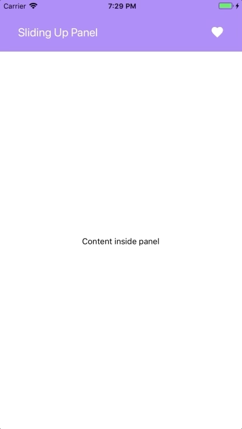

# Sliding up panel 

React Native draggable sliding up panel purly implemented in Javascript. Inspired by [AndroidSlidingUpPanel](https://github.com/umano/AndroidSlidingUpPanel). Works nicely on any platforms.

Demo: [Expo](https://expo.io/@octopitus/SlidingUpPanel) | [web](https://codesandbox.io/s/3440ox733m)

## [Explore the docs »](https://octopitus.github.io/rn-sliding-up-panel/)
